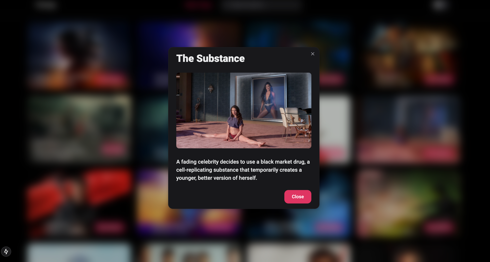

# 🎥 Movie App Project 🎬 🍿

A React-based movie app that allows users to view movie details, including title, description, release date, popularity, and an image. The project uses Next.js, NextUI, and React to deliver an interactive and dynamic UI.

## Features

- **Movie List**: Display a list of movies fetched from TheMovieDB API.
- **Movie Information**: View detailed information about a specific movie, including title, description, and an image.
- **Modal with Backdrop**: The modal includes a blurred backdrop when opened for better focus on the content.
- **Responsive Design**: The app is fully responsive and works well on different screen sizes.
- **Pagination**: Users can navigate through different pages of movie results using the pagination component.
- **Search Functionality**: Users can search for movies by title and see relevant results.
- **Dark/Light Mode Toggle**: Users can switch between dark and light themes, allowing them to customize the appearance based on their preference.


## Technologies Used

- **React**: Front-end library for building the user interface.
- **Next.js**: Framework for server-side rendering, routing, and API calls.
- **NextUI**: UI component library to create modern, customizable components (like buttons, modals, etc.).
- **TypeScript**: Type-safe programming language for better maintainability and fewer runtime errors.
- **Tailwind CSS**: For custom styling and responsiveness.
- **Fetch API**: To make HTTP requests to the movie API.

## App Images

 
 
 
 
 


## Setup Instructions

1. **Clone the Repository**:
    ```bash
    git clone https://github.com/jaironf/Movie-App-Nextjs.git
    cd movie-app
    ```

2. **Install Dependencies**:
    Make sure you have [Node.js](https://nodejs.org/) installed. Then, install the necessary dependencies:
    ```bash
    npm install
    ```

3. **Run the Development Server**:
    Start the development server using the following command:
    ```bash
    npm run dev
    ```
    The app should now be accessible at `http://localhost:3000`.

## Usage

- **Viewing Movie Details**: Click on the "View Details" button for a movie to open the modal, which will display the movie's title and description.
- **Modal Backdrop**: The modal backdrop is set to a blur effect when opened, helping focus the user's attention on the modal content.


## Learn More

To learn more about Next.js, take a look at the following resources:

- [Next.js Documentation](https://nextjs.org/docs) - learn about Next.js features and API.
- [Learn Next.js](https://nextjs.org/learn) - an interactive Next.js tutorial.

You can check out [the Next.js GitHub repository](https://github.com/vercel/next.js) - your feedback and contributions are welcome!

## Deploy on Vercel

The easiest way to deploy your Next.js app is to use the [Vercel Platform](https://vercel.com/new?utm_medium=default-template&filter=next.js&utm_source=create-next-app&utm_campaign=create-next-app-readme) from the creators of Next.js.

Check out our [Next.js deployment documentation](https://nextjs.org/docs/app/building-your-application/deploying) for more details.
